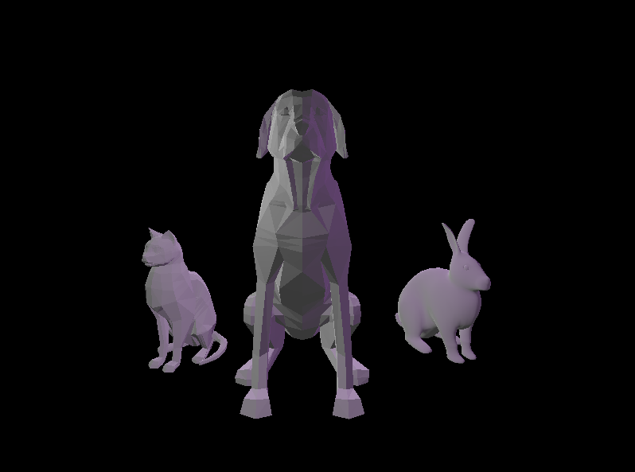

# CMPM163Labs

### Lab2 Links ###

Part 1: https://drive.google.com/file/d/1ACo5XpEQ8MfZEg5560vghqchN7U__4iT/view?usp=sharing

Part2: 

### Lab3 Links ###

Video: https://drive.google.com/file/d/1fAPEKyJjPZtx6o9RtNOoCt4IIVTblyU1/view?usp=sharing

Cube Description (Left to Right):
  Cube #1: For this cube, I interpolated between light pink/red or pink/yellow depending on the fragment's posisition, specifically the z coord of gl_FragCoord, using my own Fragment Shader.
  Cube #2: For this cube, I interpolated between blue and light purple using the provided shaders (part 2 example).
  Cube #3: For this cube, I used the Phong lighting model to make a grey material with a green specular highlight (part 1 example).
  Cube #4: For this cube, I used a Lambertian model to create a matte purple cube with some white emmissive lighting.
