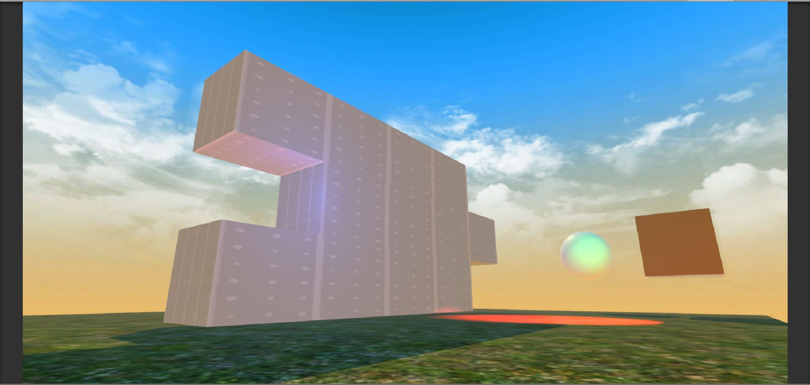
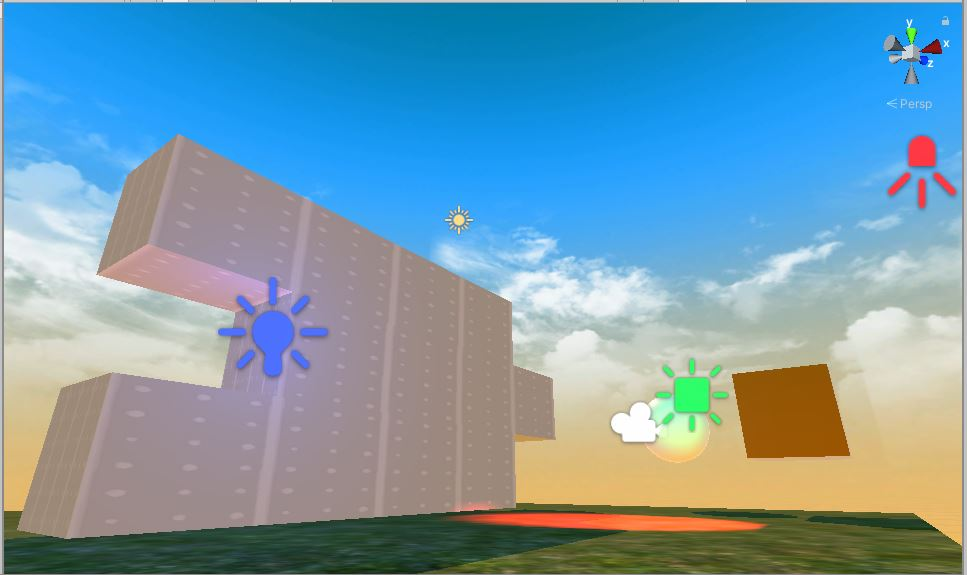
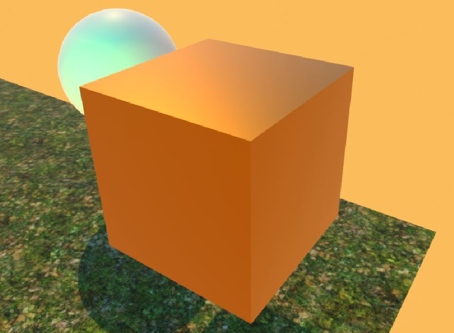
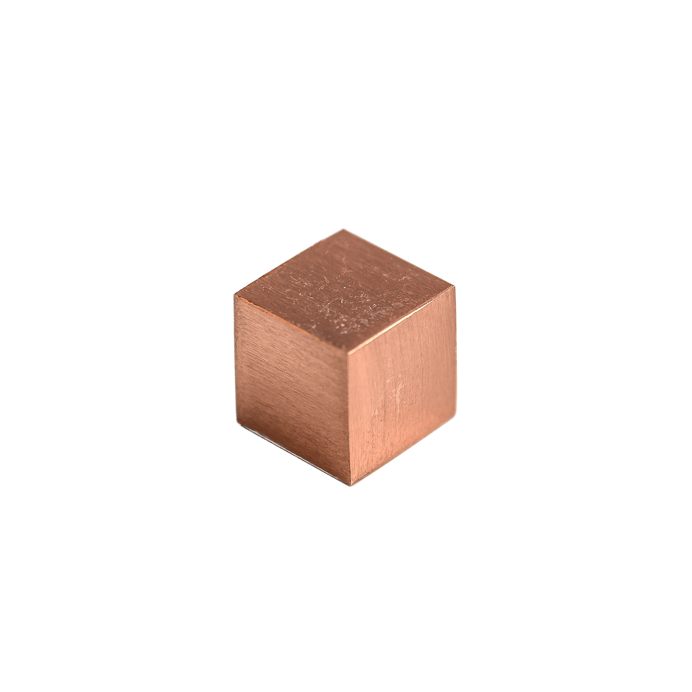

# CMPM163Labs

### Lab2 Links ###

Part 1: https://drive.google.com/file/d/1ACo5XpEQ8MfZEg5560vghqchN7U__4iT/view?usp=sharing

Part2:

### Lab3 Links ###

Video: https://drive.google.com/file/d/1fAPEKyJjPZtx6o9RtNOoCt4IIVTblyU1/view?usp=sharing

Cube Description (Left to Right):

  Cube #1: For this cube, I interpolated between light pink/red or pink/yellow depending on the fragment's posisition, specifically the z coord of gl_FragCoord, using my own Fragment Shader.

  Cube #2: For this cube, I interpolated between blue and light purple using the provided shaders (part 2 example).

  Cube #3: For this cube, I used the Phong lighting model to make a grey material with a green specular highlight (part 1 example).

  Cube #4: For this cube, I used a Lambertian model to create a matte purple cube with some white emmissive lighting.

### Lab4 Links ###

Video: https://drive.google.com/file/d/15fZyr5HU_z1h3WkJ2qSLsGCIjmNLqBIA/view?usp=sharing

Cube Descriptions (Top to Bottom, Left to Right)

Cube #1: This cube uses the built-in Three.js functions to texture the cube using image 195.

Cube #2: This cube uses the built-in Three.js functions to apply the same texture as Cube #1 with Normal Map 195.

Cube #3: This cube uses the built-in Three.js functions to apply texture 173b and Normal Map 172 to the cube.

Cube #4: This cube uses custom vertex and fragment shaders, specifically texture2D to apply texture 172 to the cube baed on the resulting texels from vUv. 

Cube #5: This cube uses the same vertex shader as Cube #4 with a new fragment shader. This new fragment shader tiles texture 176 in a 2x2 grid by taking the mod of vUv and .5 and multiplying the vUv parameter in texture2D by 2.0. 

Answers to Question 24:

  A. x-value = u * 7

  B. y-value = (1 - v) * 7

  C. White
  
  
## Lab5 Links ##
# (Part 1) #

Video: https://drive.google.com/file/d/1d9cMXqqWTpz4jSZWgeVZggQ7TceYzGNj/view?usp=sharing 

Modfications:
- Implemented particle system on Kart so it emits blue glowing orbs. Added random gravity, start color, and modified the shape of the system so particles are emmitted from Kart towards camera.

- Modified Directional Light. Changed color of light (yellow), increased intensity, switched to hard shadows, and enabled a halo on the light.

- Manipulated Track Design to include removed portion, deleted unused track. Added trees, rocks, and satellite disk to environment.

- Added prefab particle system to emit particles when Kart bounces into object. Modified system to change color, frequency of particles.

- Added prefab Trail so Kart emits rainbow trail while in motion.

## Lab6 Links ##
# (Part 1) #

 

Definitions:
A point light is a light that emits color in all directions from a specific point.
A spotlight is a light that emits color at a specific angle from a specific point.
A directional light has emits light from a specifc direction that hits all objects in the scene.
An area light emits light from a rectangular face, but is calculated before runtime and applied to the scene using light maps.

I made a copper material using the standard shader and increasing the metallic attribute and smoothness attribute. I used color #b87333.

 

I used a grass texture on the ground plane and a drywall texture on the stacked rectangles.

I added a sunny skybox with circling clouds to the scene also.

## Lab7 Links ##
# (Part 1) #

Video: https://drive.google.com/open?id=16zO3pgm-zKiScxaBAkdrawHOKZtb6MS-

Description: To make the sphere,  I implemented the Vertex Displacement shader described in the tutorial. To make the Mountain Range, I modified the displacement shader so that it used the X and Z coordinates of the objects position in the Voronoi node and changed the slider node so the value could be increased to 4.5. For the wave, I implemented the WaveShader described in the tutorial, setting the color to a light blue, the strength to .1, and the speed to 25. To complete the Scene, I added some Sand Swirl Particle effects from the unity particle pack to create a shifting desert mountain vibe, addded a few palm trees I found in aother asset pack,  and added some spark particles around the deformed, floating sphere. I modified the parameters (eg. scale, shape, emission) for each so they were perfect for my scene. I also scaled up the mountain range and waves and added a skybox.

Partner: My partner did not have their name on Discord so I wasn't able to contact them (as of 5/17/2020).
